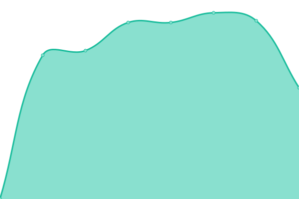

# [📈 Live Status](https://status.greenbaum.cloud): <!--live status--> **🟩 All systems operational**

This repository contains the open-source uptime monitor and status page for [GREENBAUM Forschungsgesellschaft mbH](https://greenbaum.institute), powered by [Upptime](https://github.com/upptime/upptime).

With [Upptime](https://upptime.js.org), you can get your own unlimited and free uptime monitor and status page, powered entirely by a GitHub repository. We use [Issues](https://github.com/greenbaum/upptime/issues) as incident reports, [Actions](https://github.com/greenbaum/upptime/actions) as uptime monitors, and [Pages](https://status.greenbaum.cloud) for the status page.

<!--start: status pages-->
<!-- This summary is generated by Upptime (https://github.com/upptime/upptime) -->
<!-- Do not edit this manually, your changes will be overwritten -->
<!-- prettier-ignore -->
| URL | Status | History | Response Time | Uptime |
| --- | ------ | ------- | ------------- | ------ |
|  [Greenbaum Mail](https://mail.greenbaum.cloud) | 🟩 Up | [greenbaum-mail.yml](https://github.com/greenbaum/upptime/commits/HEAD/history/greenbaum-mail.yml) | 

 2265ms
     
 | 

<a href="https://status.greenbaum.cloud/history/greenbaum-mail">100.00%</a>
    

|  [Greenbaum Auth](https://auth.greenbaum.cloud) | 🟩 Up | [greenbaum-auth.yml](https://github.com/greenbaum/upptime/commits/HEAD/history/greenbaum-auth.yml) | 

 716ms
     
 | 

<a href="https://status.greenbaum.cloud/history/greenbaum-auth">100.00%</a>
    

|  [Greenbaum Meet](https://meet.greenbaum.cloud) | 🟩 Up | [greenbaum-meet.yml](https://github.com/greenbaum/upptime/commits/HEAD/history/greenbaum-meet.yml) | 

 930ms
     
 | 

<a href="https://status.greenbaum.cloud/history/greenbaum-meet">100.00%</a>
    

|  [Nextcloud](https://next.greenbaum.cloud) | 🟩 Up | [nextcloud.yml](https://github.com/greenbaum/upptime/commits/HEAD/history/nextcloud.yml) | 

 1276ms
     
 | 

<a href="https://status.greenbaum.cloud/history/nextcloud">100.00%</a>
    

|  [Mattermost](https://chat.greenbaum.cloud) | 🟩 Up | [mattermost.yml](https://github.com/greenbaum/upptime/commits/HEAD/history/mattermost.yml) | 

 483ms
     
 | 

<a href="https://status.greenbaum.cloud/history/mattermost">99.20%</a>
    

|  [Wekan](https://wekan.greenbaum.institute) | 🟩 Up | [wekan.yml](https://github.com/greenbaum/upptime/commits/HEAD/history/wekan.yml) | 

 726ms
     
 | 

<a href="https://status.greenbaum.cloud/history/wekan">100.00%</a>
    

|  [HelpDesk](https://help.greenbaum.cloud) | 🟩 Up | [help-desk.yml](https://github.com/greenbaum/upptime/commits/HEAD/history/help-desk.yml) | 

 809ms
     
 | 

<a href="https://status.greenbaum.cloud/history/help-desk">100.00%</a>
    

|  [Gitea](https://git.greenbaum.cloud) | 🟩 Up | [gitea.yml](https://github.com/greenbaum/upptime/commits/HEAD/history/gitea.yml) | 

 942ms
     
 | 

<a href="https://status.greenbaum.cloud/history/gitea">100.00%</a>
    

|  [Docker registry](https://hub.greenbaum.cloud) | 🟩 Up | [docker-registry.yml](https://github.com/greenbaum/upptime/commits/HEAD/history/docker-registry.yml) | 

 847ms
     
 | 

<a href="https://status.greenbaum.cloud/history/docker-registry">100.00%</a>
    

<!--end: status pages-->

[**Visit our status website →**](https://status.greenbaum.cloud)

## 📄 License

- Powered by: [Upptime](https://github.com/upptime/upptime)
- Code: [MIT](./LICENSE) © [GREENBAUM Forschungsgesellschaft mbH](https://greenbaum.institute)
- Data in the `./history` directory: [Open Database License](https://opendatacommons.org/licenses/odbl/1-0/)
